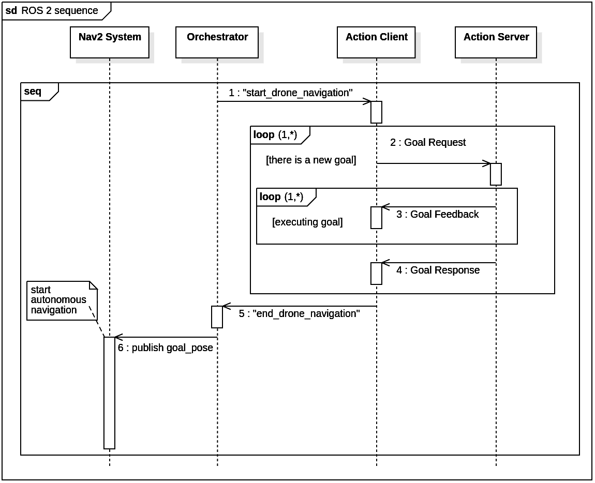

# ros2_ignition_thesis
Simulazione con ROS 2 Humble + Ignition Fortress (Gazebo). Utilizzo di Slam Toolbox per la scansione della mappa e del framework nav2 per implementare un sistema di guida autonoma in un magazzino.  
Questo repository contiene 4 package ROS 2 e il pdf della mia Tesi di laurea Triennale in Informatica presso l'Università degli Studi di Firenze.  
"*You can watch the simulation on YouTube by clicking on the following picture*"  

### Descrizione contenuto package
#### my_sim_tesi_bringup
  * config/ -> contiene i file di configurazione dei nodi (file .yaml) e di rviz2 (file .rviz);
  * files/ -> contiene il file coordinates_goal.txt che viene passato come parametro alla classe PoseControlActionClient per definire le posizioni obiettivo che devono essere di volta in volta raggiunte;
  * launch/ -> contiene i file di lancio Python:
    1. Per avviare la scansione della mappa statica con Slam Toolbox utilizzare my_sim_map_scan.launch.py
    2. Per avviare la simulazione utilizzare my_sim_final.launch.py (che al suo interno lancia anche i file my_ros2_nodes.launch.py e nav2.launch.py)
  * map/ -> contiene i file delle mappe (my_map.yaml e my_map.pgm) generati al termine della scansione della mappa statica (launch file my_sim_map_scan.launch.py) con il comando da terminale Linux "ros2 run nav2_map_server map_saver_cli"
#### my_sim_tesi_gazebo
  * models/ -> è la cartella contenente tutti i modelli sdf utilizzati nella simulazione
  * worlds/ -> è la cartella contenente gli worlds utilizzati nella simulazione (in questo caso uno solo, my_world.sdf) 
#### my_sim_tesi_ros2_interfaces
  * action/ -> contiene il file che definisce la sola action utilizzata nella simulazione (file DronePoseControl.action per la action DronePoseControl)
#### my_sim_tesi_ros2_nodes
  * include/my_sim_tesi_ros2_nodes/ -> contiene i file header hpp:
    1. orchestrator_node.hpp
    2. pose_control_action_client.hpp
    3. pose_control_action_server.hpp
  * src -> contiene i file C++ che implementano gli header (presenti nella cartella include/my_sim_tesi_ros2_nodes/):
    1. orchestrator_node.cpp
    2. pose_control_action_client.cpp
    3. pose_control_action_server.cpp
### Descrizione generazione mappa statica con Slam Toolbox
Per generare la mappa statica del magazzino, è stato utilizzato Slam Toolbox.

ATTENZIONE: prima di avviare l'esecuzione, assicurarsi che nel file my_sim_tesi_gazebo/models/pioneer2dx/model.sdf la configurazione del lidar abbia gli "horizontal samples" impostati a 1200 e il "range max" impostato a 15 (il lidar è configurato in modo che sia più potente durante la scansione della mappa rispetto alla simulazione per poter acquisire dati più precisi).

Una volta lanciato il file my_sim_map_scan.launch.py (ros2 launch my_sim_tesi_bringup my_sim_map_scan.launch.py), si aprono le applicazioni Gazebo ed Rviz2. Su Gazebo dobbiamo attivare il plugin-gui Key Publisher così da poter muovere il robot a trazione differenziale (modello in my_sim_tesi_gazebo/models/pioneer2dx) tramite la tastiera.  
Il robot si muove come segue:
* freccia in sù -> movimento lineare in avanti
* freccia in giù -> movimento lineare all'indietro
* freccia verso sinistra -> rotazione verso sinistra
* freccia verso destra -> rotoazione verso destra
* tasto 's' -> il robot si ferma
Dopo aver navigato per tutto il magazzino, possiamo vedere la mappa scansionata tramite RViz2 e con il comando da terminale Linux "ros2 run nav2_map_server map_saver_cli" generiamo i file map_xxx.yaml e map_xxx.pgm che verranno usati nel framework nav2 per la navigazione autonoma.
### Descrizione della simulazione
ATTENZIONE: prima di avviare la simulazione, assicurarsi che nel file my_sim_tesi_gazebo/models/pioneer2dx/model.sdf la configurazione del lidar abbia gli "horizontal samples" impostati a 450 e il "range max" impostato a 5 (il lidar è configurato in modo che sia più potente durante la scansione della mappa rispetto alla simulazione).

La simulazione consiste in un drone controllato da nodi ROS 2 che, a seguto del decollo, segue una traiettoria prefissata sulla base del file my_sim_tesi_bringup/files/coordinates_goal.txt. A seguito del decollo, viene avviata la navigazione autonoma del robot a trazione differenziale (utilizzando il framework nav2).  
La simulazione è gestita da un nodo ROS 2 con funzione di orchestratore (file C++ /my_sim_tesi_ros2_nodes/src/orchestrator_node.cpp). Esso, all'inizio della simulazione, pubblica sul topic /quadcopter/start_navigation la stringa "start_drone_navigation" che viene letta dall'action client (file /my_sim_tesi_ros2_nodes/src/pose_control_action_client.cpp) che comincia ad inviare i goal al server (file /my_sim_tesi_ros2_nodes/src/pose_control_action_server.cpp) che iniva comandi di velocità al drone. Al termine dei goal, il client pubblica sul topic /quadcopter/end_navigation la stringa "end_drone_navigation" che viene ricevuta dall'ochestratore che pubblica sul topic /goal_pose di nav2 le coordinate che il robot a guida autonoma dovrà raggiungere così che esso possa avviare la navigazione.  
Il seguente sequence diagram descrive, con un livello di astrazione tale da non mostrare i dettagli implementativi del sistema nav2, l'ordine degli eventi durante la simulazione

### Riferimenti bibliografici
Tutto il materiale di terze parti che è stato utilizzato, è stato citato nella bibliografia presente al termine del pdf della tesi.
